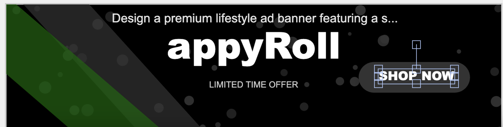
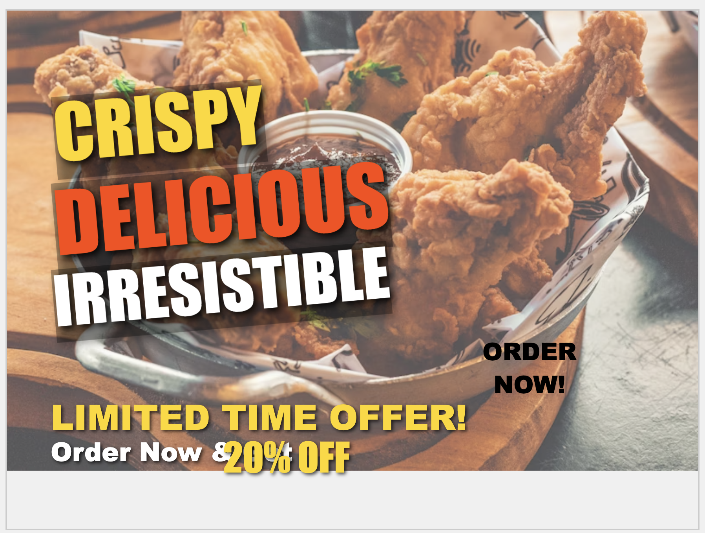
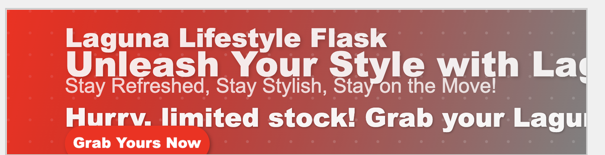
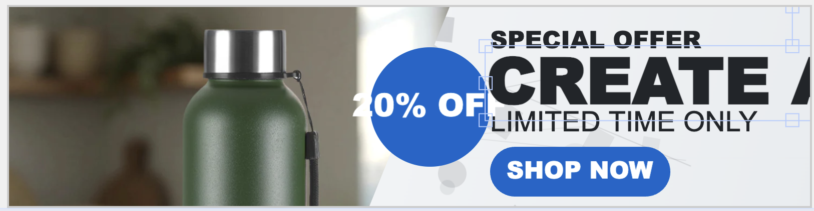

# AI Banner Generator

A powerful web application that allows users to create customized promotional banners leveraging AI-generated content and dynamic layouts.



## Features

- **AI-Powered Content Generation**: Generate creative copy for your banners using advanced language models
- **Multiple Layout Templates**: Choose from a variety of professional layouts including:
  - Modern Agency
  - Minimal Product
  - Vibrant Retail
- **Dynamic Styling**: Automatic color schemes and typography based on product context
- **Image Integration**: Upload and incorporate product images with intelligent placement
- **Background Generation**: AI-generated patterns and backgrounds that complement your content
- **Responsive Design**: Banner adapts to different screen sizes while maintaining visual appeal

## Examples

### Travel Promotion Banner

*Discover Paradise vacation promotion with price point and limited-time offer*

### Food Promotion Banner

*Restaurant promotion featuring appetizing food imagery with bold typography*

### Product Showcase Banner

*Clean, minimal product showcase with person image and call-to-action*

### Lifestyle Product Banner

*Lifestyle product promotion with gradient background and clear messaging*

## Technical Architecture

The application follows a modular architecture:

- **BannerContext**: Core business logic for banner generation
- **BannerModel**: Data structures defining layouts and styles
- **BannerUI**: User interface components and interaction handling
- **BannerProtocol**: Communication layer between components

## Getting Started

1. Clone the repository
```bash
git clone https://github.com/yourusername/banner-generator.git
cd banner-generator
```

2. Configure API key (optional, for AI content generation)
```bash
# Create a .env file in the root directory
echo "OPENAI_API_KEY=your_api_key_here" > .env
```

3. Open `index.html` in your browser or use a local server
```bash
# Using Python's built-in server
python -m http.server
```

4. Upload an image, enter a product description, select a layout, and generate your banner!

## Theme & Template Customization

The application uses a template-based approach where layouts define structure while the LLM dynamically generates content.

### Layout Template Structure

Templates are defined in `themes.js` with the following structure:

```javascript
{
  canvas: { width: 1200, height: 600 },
  contentArea: {
    position: { x: "8%", y: "20%" },
    width: "45%",
    elements: [
      { type: "label", position: {...}, style: {...} },
      { type: "heading", position: {...}, style: {...} },
      // More elements...
    ]
  },
  imageArea: {
    position: { x: "75%", y: "50%" },
    width: "45%",
    mask: "circle" // or "rectangle", "overlay"
  },
  background: {
    base: "gradient",
    pattern: "dots",
    accent: "wave"
  }
}
```

### LLM Content Generation

When you provide a product description, the AI generates the following:

1. **Text Content**
   - Top label (e.g., "FEATURED", "NEW ARRIVAL")
   - Main heading (compelling product title)
   - Description (short product benefits)
   - Tagline (memorable phrase)

2. **Design Elements**
   - Color palette (primary, secondary, text colors)
   - Style mood (luxurious, modern, playful, etc.)
   - Background pattern suggestions

3. **Dynamic Layout Adjustments**
   - Font choices based on product category
   - Text positioning and scaling
   - Color contrast optimization
   - Element emphasis based on content

### Adding Custom Templates

To add a new template layout:

1. Open `models/BannerModel.js`
2. Add your template to the `layouts` object:

```javascript
myCustomLayout: {
  canvas: { width: 1200, height: 600 },
  contentArea: {
    // Define content structure
  },
  imageArea: {
    // Define image area
  },
  background: {
    // Define background layers
  }
}
```

The LLM will automatically adapt its generated content to fit your custom layout!

## Configuration

You can customize the available layouts by modifying the `themes.js` file. Each layout template defines:

- Canvas dimensions
- Content positioning
- Image placement and masking
- Background layers
- Typography and spacing

## Using AI for Content & Style Customization

The AI banner generator allows fine-tuning of content generation through your product descriptions:

### Guiding the LLM with Descriptive Prompts

The quality and specificity of your product description directly influences the generated content. Try including:

- **Industry Keywords**: "luxury watch", "fitness app", "organic food"
- **Target Emotions**: "energizing", "calming", "exciting", "professional"
- **Color Preferences**: "using blue tones", "with earthy colors"
- **Style Direction**: "modern minimal design", "vintage aesthetic", "bold and vibrant"

Example prompts that generate great results:

```
Luxury watch with elegant gold accents for sophisticated customers
```
```
Energizing fitness app with bold motivational messaging and vibrant colors
```
```
Organic farm-to-table restaurant focusing on sustainable, healthy ingredients
```

### Real-time Style Application

As the LLM analyzes your product description, it makes intelligent design choices:

1. **Contextual Color Selection**: The AI selects color schemes that match the product category and emotional tone. 
   - Luxury products get elegant palettes with gold accents
   - Tech products receive modern, cool-toned schemes
   - Food products are paired with appetizing, warm colors

2. **Typography Adjustments**: Font styles are selected based on the product context.
   - Luxury items use serif fonts with elegant spacing
   - Modern products use clean sans-serif typography
   - Creative services employ more expressive typography

3. **Layout Enhancement**: Background patterns and element positioning adapt to highlight key features.
   - Product-focused descriptions prioritize image display
   - Service-focused descriptions emphasize text content
   - Promotional offers highlight price points and CTAs

All these adjustments happen automatically when you click "Generate Banner" - no design experience required!

## API Key Setup

To enable AI-generated content:

1. Get an API key from [OpenAI](https://platform.openai.com/)
2. Create a `.env` file in the project root
3. Add your API key: `OPENAI_API_KEY=your_api_key_here`

Note: If no API key is provided, the application will use predefined fallback content instead of generating new content.

## Advanced Developer Customization

### Modifying the LLM Integration

For developers who want to enhance or customize the AI content generation:

1. **System Prompt Customization**:
   - Navigate to `contexts/BannerContext.js`
   - Locate the `generateContent` method
   - Modify the system prompt to change how the AI interprets requests
   
   ```javascript
   // Example: Adding industry-specific guidance
   role: "system",
   content: `You are a creative advertising copywriter specializing in [YOUR_INDUSTRY].
     Generate engaging content for a product banner based on the description.
     Return a JSON object with the following structure...`
   ```

2. **Extending JSON Response Structure**:
   - Enhance the returned JSON structure to include additional elements
   - Update the corresponding rendering functions to use these new fields

   ```javascript
   // Example: Adding additional fields
   {
     "topLabel": "...",
     "mainHeading": "...",
     "description": "...",
     "tagline": "...",
     "ctaText": "SHOP NOW", // New custom CTA text
     "audience": "young professionals", // Target demographic
     "design": {
       "colors": {...},
       "style": {...},
       "animation": "slide-in" // New animation style
     }
   }
   ```

3. **Custom Background Pattern Generation**:
   - Locate the `generateBackgroundPattern` method
   - Customize the pattern generation prompt or add new pattern types
   - Update the `addPatternElements` function to render new pattern types

### Integrating Additional AI Models

The application can be extended to support other AI providers:

1. Create adapter functions that maintain the same input/output structure
2. Implement model-specific error handling and fallbacks
3. Update the environment variables to support multiple API providers

```javascript
// Example adapter for alternative AI provider
async generateContentWithAlternativeAI(prompt) {
  // Implementation for different API
  // Must return data in the same structure
}
```

By maintaining the same content structure, you can swap AI providers without changing the rendering logic.

## Screenshot Setup for GitHub

**Note for Repository Setup:**
1. Before pushing to GitHub, replace the placeholder files in the `screenshots` directory with the actual banner images shown in this README
2. Ensure each image is properly named to match the references in this document:
   - `preview.png` - Main application interface
   - `travel_banner.png` - Travel promotion example
   - `food_banner.png` - Food promotion example
   - `product_banner.png` - Product showcase example
   - `lifestyle_banner.png` - Lifestyle product example

## License

MIT

## Acknowledgements

- Uses [Fabric.js](http://fabricjs.com/) for canvas manipulation
- AI content generation powered by OpenAI's GPT models 